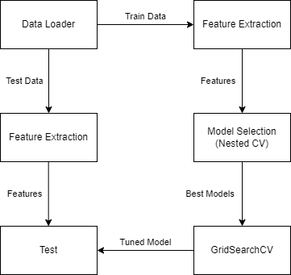

# SAFP

## Signal Analysis Final Project

The idea of this project is to do song classification using machine learning.
We are using a custom dataset of 30 different songs, each 5 seconds long.
Noise is added to the songs to make them more realistic.
The training set contains 2,400 samples and the test set contains 600 samples.

## Goal

The goal is to have two models that can classify songs with an accuracy of 90% or higher.

## Getting Started
1. Install the requirements:

        pip install -r requirements.txt

2. Train the models:

        python train.py

3. Test the models:
    
        python test.py

#### Note
The training may take 10-30 minutes depending on your machine. This is because the training step will tune parameters for each model using GridSeach and cross validation. To skip the training step download the model weights in the releases section of this repo.

### Models Tested
* K-Nearst Neighbors
* Gaussian Naive Bayes
* Decision Tree
* Random Forest
* AdaBoost + Decision Tree

### Methods

We are using two different feature extraction methods: Spectrogram and Power Spectrum Density.
For more details see the [docs/report.pdf](docs/report.pdf).

### Results

#### Results for Spectrogram feature extraction:

| Model | Accuracy | F1 Score |
|-------|----------|----------|
| RF    | 0.998    | 0.998    |
| DT    | 0.962    | 0.961    |

#### Results for Power Spectrum Density feature extraction:

| Model | Accuracy | F1 Score |
|-------|----------|----------|
| RF    | 0.977    | 0.977    |
| DT    | 0.952    | 0.951    |

### Confusion Matrices

#### Spectrogram feature extraction with Random Forest:

#### Spectrogram feature extraction:

#### Power Spectrum Density feature extraction:

#### Power Spectrum Density feature extraction:

